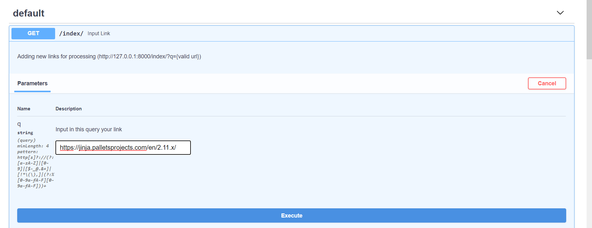
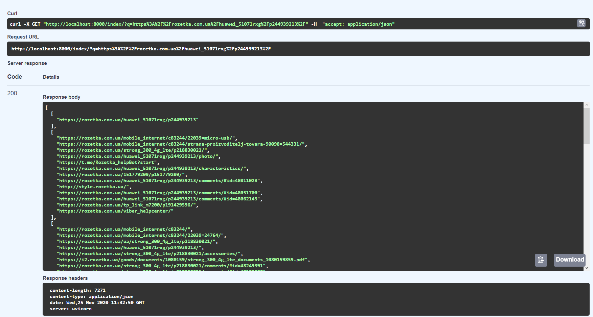
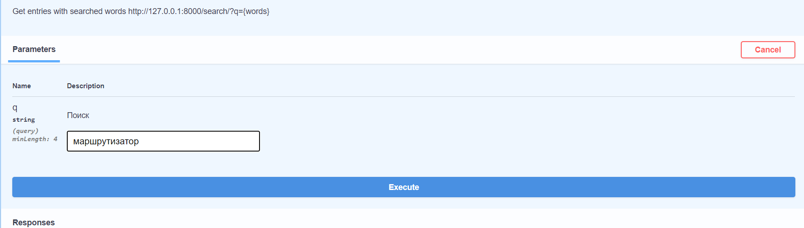
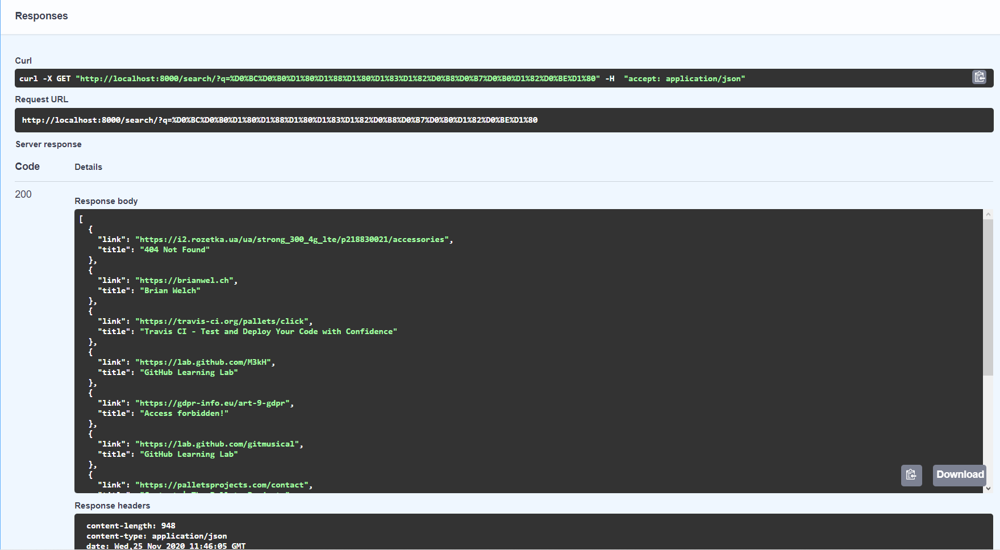

# Elgoog - a simple API “Google” clone.

### Capabilities:

1. Recursive site index with indexing depth = 3;
1. Ability to search for links by text on them - Levenshtein distance is used.

### Installation:

1. After cloning / downloading the repository, execute dependent packages using the command
   `pip install -r requirements.txt`.
1. Then, to run the project from its main directive, you need to execute the command `docker-compose up --build`.
1. Local API testing can be done using Insomnia REST client or debug page
   FastAPI http://localhost:8000/docs/. [Docker](https://hub.docker.com/r/yaroslavrul/elgoog_fast-api)

### Interaction via API:

1. To index the link, you must run the command execute
   `http://127.0.0.1:8000/index/?q={valid url}` (For example, `http://127.0.0.1:8000/index/?q=https://rozetka.com.ua/huawei_51071rxg/p244939213/`) instead of {valid url}
   substituting the desired url. 
   The response to the request will include a list of dependent links from this link with deepening = 3.
1. To search for words or phrases in the content of indexed links, use
   command `http://127.0.0.1:8000/search/?q={words}` (For example, `http://127.0.0.1:8000/search/?q=маршрутизатор`) ,
   the answer to which will be a list of all links that match the content you are looking for
   request; ! 
   